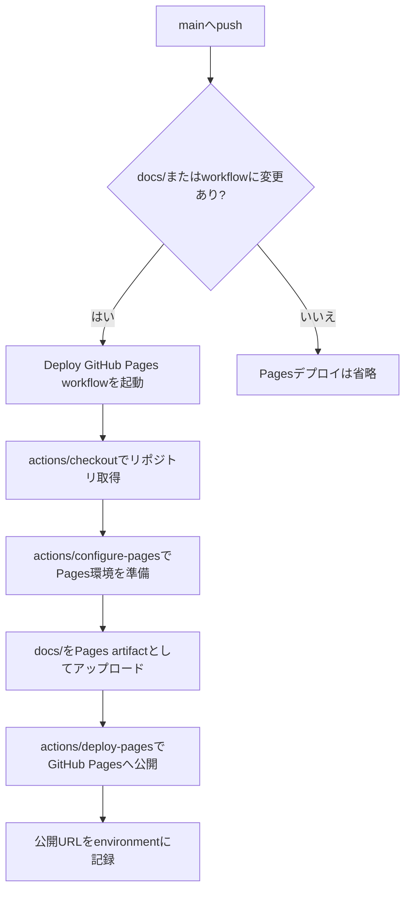

# GitHub Pagesデプロイ運用

このリポジトリの可視化サイトは、`gh-pages` ブランチへ手動同期する方式ではなく、GitHub ActionsからPagesへデプロイする方式で運用します。公開対象は `docs/` ディレクトリです。

## デプロイの流れ



## 必要なGitHub Pages設定

リポジトリ設定の **Pages** で、Build and deployment の Source は **GitHub Actions** にします。ブランチ指定による `gh-pages` 配信は使いません。

Actions側では `.github/workflows/pages.yml` が次を行います。

| 項目 | 内容 |
| --- | --- |
| トリガー | `main` へのpush、または手動実行 |
| 対象パス | `docs/**` と `.github/workflows/pages.yml` |
| アーティファクト | `docs/` ディレクトリ全体 |
| 権限 | `contents: read`, `pages: write`, `id-token: write` |
| 公開環境 | `github-pages` |

## docs更新時の確認

`docs/` は静的HTML/CSS/JavaScriptと結果アセットで構成します。依存パッケージのビルド工程はありません。

ローカルで変更を確認する例:

```bash
python3 -m http.server 8000 --directory docs
```

ブラウザで `http://localhost:8000/` を開き、ビューア、結果選択、帰属表示、STL読み込みを確認します。JavaScriptを変更した場合は次も実行します。

```bash
node --check docs/app.js
```

## 更新時の注意

1. `docs/assets/results.json` はビューアが最初に読む結果一覧です。STLや検証JSONを追加したら、ここに表示対象を追加します。
2. 大きなSTLを追加する場合は、Pages artifactのサイズとブラウザでの読み込み時間を確認します。
3. 公開に必要なファイルは `docs/` 配下に置きます。`target/` やローカル検証ログは公開対象にしません。
4. `gh-pages` ブランチへの手動pushは行いません。公開内容は `main` の `docs/` とActions実行結果から再現できる状態にします。
