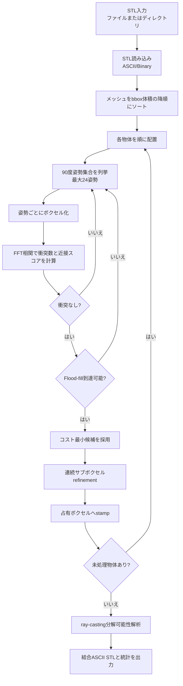
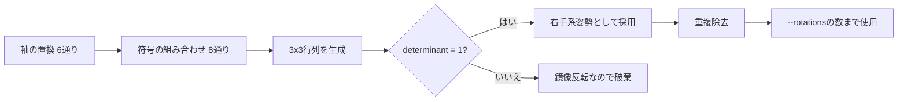
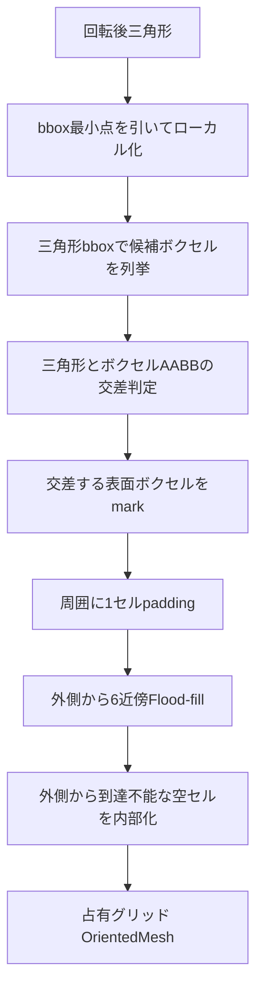
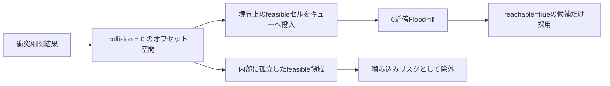
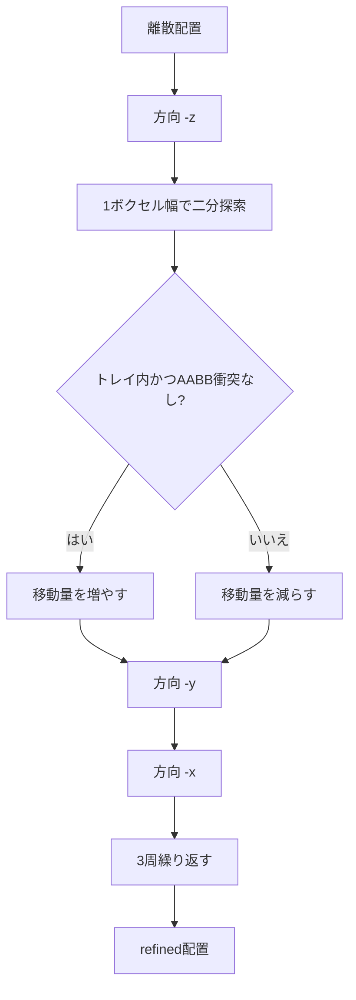
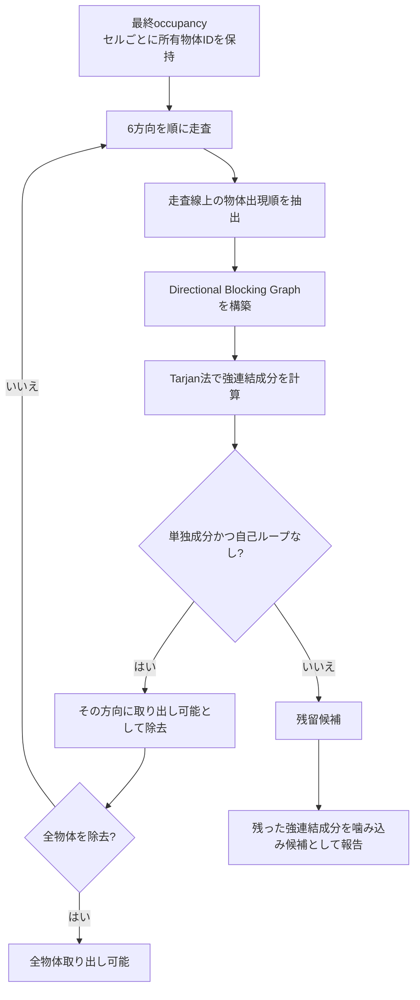
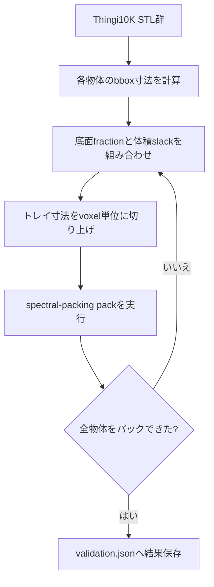

# 現状ロジック詳細

このドキュメントは、`spectral-packing` CLIの現状実装を説明するものです。対象は主に `src/main.rs` のパッキング本体、`scripts/fetch_thingi10k_cases.py` のThingi10K取得処理、`scripts/validate_thingi10k_tight.py` のbboxタイト検証処理です。

実装は、論文「汎用3D物体の高密度・非噛み込み・スケーラブルなスペクトルパッキング」の配置パイプラインをベースにした、制約充足型の3Dパッカーです。論文実装より高速であることではなく、指定されたトレイ境界、物体同士の非衝突、外側からの到達可能性など、実装が扱う制約モデルを破らない配置だけを出力することを目的にしています。

## 実装の目的と保証範囲

このリポジトリの意図は、アルゴリズムを眺めるための確認用実装ではありません。性能が論文実装に劣っていても、パック済みとして出力する解が制約違反を含まないことを優先します。

ただし、現状の実装には「厳密に扱っている制約」と「まだ幾何的に厳密化が必要な制約」があります。前者は出力時に破らない前提の制約です。後者は、現在は保守ボクセル化やAABBによる安全側のモデルで扱っており、今後の改善対象です。

| 区分 | 制約 | 現状の扱い |
| --- | --- | --- |
| 厳密に満たす対象 | トレイ境界 | 離散探索時とrefinement時にトレイ外へ出る候補を採用しない |
| 厳密に満たす対象 | 三角形が通過する表面ボクセルの占有 | 三角形とボクセルAABBの交差判定で、通過セルを必ずmarkする |
| 厳密に満たす対象 | 離散ボクセル上の物体同士の非重複 | FFT相関の衝突数がゼロの候補だけを採用する |
| 厳密に満たす対象 | 離散オフセット空間での外側到達可能性 | Flood-fillで境界から到達できる候補だけを採用する |
| 厳密に満たす対象 | refinement時の保守的な非衝突 | 三角形AABBが安全余白込みで重なる候補を採用しない |
| 厳密化が必要 | 任意回転を含む実際の分解経路 | 現状は6軸直線ray解析。回転や斜め方向の経路は未評価 |
| 厳密化が必要 | 非watertightメッシュの内部推定 | 現状は保守的な表面ボクセルと外部Flood-fillに依存する |

## 全体像



パッキングは完全な最適化問題としては解かず、物体を1つずつ固定していく貪欲法です。各物体については、トレイ内の全平行移動候補をFFT相関で評価するため、単純な全候補・全ボクセル比較より高速に配置候補を探します。

## CLIと入出力

| コマンド | 役割 |
| --- | --- |
| `spectral-packing sample` | 手続き生成した小さなSTLセットを作成する |
| `spectral-packing pack` | STL群を1つのトレイへパックし、結合ASCII STLを出力する |

`pack` は次の入力を受け取ります。

| 入力 | 内容 |
| --- | --- |
| STLファイルまたはディレクトリ | ディレクトリ指定時は直下の `.stl` を名前順に読む |
| `--width`, `--depth`, `--height` | トレイ寸法 |
| `--voxel` | ボクセルの辺長 |
| `--rotations` | 試す90度姿勢数。最大24 |
| `--height-weight` | 上方向に積むことへのペナルティ |
| `--refine-margin` | refinement中の三角形AABBクリアランス |
| `--no-refine` | サブボクセル補正を無効化 |
| `--no-interlock` | Flood-fill到達可能性フィルタを無効化 |
| `--no-ray-disassembly` | ray-casting分解可能性解析を無効化 |

出力は、配置に成功した物体の三角形を1つにまとめたASCII STLです。あわせて、パック数、ボクセル密度、メッシュ密度、各物体のオフセット・平行移動量・refinement量・姿勢番号、ray分解判定を標準出力へ表示します。

## データ構造

| 構造体 | 主な役割 |
| --- | --- |
| `Vec3` | 3次元ベクトル。加減算、内積、外積、長さ、min/maxを提供 |
| `Mesh` | STLから読んだ三角形列と名前 |
| `Rotation` | 90度刻みの右手系回転行列 |
| `OrientedMesh` | 特定姿勢に回転・正規化し、ボクセル化済みの物体 |
| `Tray` | トレイ寸法、ボクセルサイズ、グリッド分割数 |
| `Placement` | 探索中の配置候補。姿勢、オフセット、コストを保持 |
| `PlacedMesh` | 採用済み物体。変換済み三角形、占有セル、統計値を保持 |
| `PackResult` | 配置成功・失敗リストとray分解レポート |

内部の3次元配列は、`idx(x, y, z, nx, ny) = (z * ny + y) * nx + x` で1次元配列へ格納します。

## STL読み込みとサンプル生成

STL読み込みはASCII/Binary両対応です。Binary STLは80バイトヘッダ後の三角形数とファイル長が一致するかで判定し、各三角形の法線は読み飛ばして頂点だけを使用します。ASCII STLは `vertex` 行を集め、3頂点ごとに1三角形として扱います。

手続き生成サンプルでは、直方体、L字ブロック、U字ブリッジ、三角柱、円柱、星形柱を三角形リストとして作り、ASCII STLへ書き出します。これは外部データに依存せずに制約処理の基本挙動を確かめるための最小サンプルです。

## 姿勢生成

姿勢は、座標軸の置換と符号反転から3x3行列を作り、行列式が `1` のものだけを残します。これにより、反転を含まない右手系の90度刻み姿勢を最大24個得ます。



任意角度の姿勢探索は行いません。探索空間を抑える代わりに、箱詰めで効果が出やすい軸揃え姿勢を高速に試す設計です。

## ボクセル化

各姿勢のメッシュは次の手順でボクセル化します。

1. 三角形頂点へ回転を適用する。
2. 回転後bboxの最小点を引き、物体ローカル座標へ移す。
3. bbox寸法とボクセルサイズから物体グリッド寸法を決める。
4. 各三角形のbboxが重なる候補ボクセルを列挙する。
5. 三角形と各ボクセルAABBの交差をSeparating Axis Theoremで判定し、交差する表面ボクセルをmarkする。
6. パディングしたグリッドの外側から6近傍Flood-fillし、外部から到達できないセルを内部として埋める。
7. 表面または内部のセルを物体占有セルとする。



三角形とボクセルAABBの交差判定は、AABB軸、三角形法線、三角形辺とAABB軸の外積軸を使うSeparating Axis Theoremで行います。これにより、三角形が少しでも通過するボクセルは表面セルとして占有されます。追加の膨張は行いません。ボクセルを大きめに取るほど解は粗くなりますが、三角形通過セルの取りこぼしによる交差見落としは避けます。

## FFT相関による候補評価

配置済み占有グリッドを `O`、配置したい物体の占有グリッドを `P` とします。平行移動 `q` における衝突数は、概念的には次の相関です。

```text
collision(q) = Σ O(x) * P(x - q)
```

全 `q` を直接計算すると、候補数と物体ボクセル数の積になります。実装では `rustfft` で3次元FFTを行い、周波数領域で積を取って逆FFTすることで、全候補の衝突数を一括で得ます。

同時に、配置済みセルとトレイの下側境界からのマンハッタン距離場 `D` を作り、物体との相関を近接スコアとして計算します。

```text
proximity(q) = Σ D(x) * P(x - q)
fit_cost(q) = proximity(q) / occupied_voxel_count(P)
height_cost(q) = height_weight * (q_z / tray_nz)^3
cost(q) = fit_cost(q) + height_cost(q)
```

距離場は「既存物体や下側境界に近いほど小さい」値になります。そのため、`fit_cost` が小さい候補ほど既存の詰まりに寄せられます。高さペナルティは、上方向へ積み上げる配置を必要以上に選ばないための項です。

```mermaid
flowchart TD
    A[配置済みoccupancy] --> B[boolグリッドFFT]
    A --> C[マンハッタン距離場]
    C --> D[距離場FFT]
    E[姿勢ごとの物体occupancy] --> F[物体FFT]
    B --> G[衝突相関<br>IFFT(FFT(O) * conj(FFT(P)))]
    F --> G
    D --> H[近接相関<br>IFFT(FFT(D) * conj(FFT(P)))]
    F --> H
    G --> I[衝突ゼロ候補だけ残す]
    H --> J[近接コスト]
    I --> K[高さペナルティを加算]
    J --> K
    K --> L[最小コスト候補を選ぶ]
```

3次元FFTは、x方向、y方向、z方向の1次元FFTを順に適用して実現しています。逆変換時は `nx * ny * nz` で正規化します。

## Flood-fill到達可能性フィルタ

衝突しない候補でも、既存物体の隙間の奥など、外側から平行移動だけでは到達できない場所にある場合があります。そこで、物体のオフセット空間を作り、衝突しないオフセットを `feasible` として扱います。

実装は、オフセット空間の境界にある `feasible` セルから6近傍Flood-fillし、外側から到達できる候補だけを採用します。



この判定は「現在姿勢のまま、グリッド上を平行移動して外側から到達できるか」を厳密に見るものです。任意回転を含む実際の組立・分解経路の完全判定ではないため、連続空間での非噛み込み制約としては改善対象です。

## 連続サブボクセルrefinement

FFT探索はボクセル格子上の離散オフセットを返します。採用後、物体を少しだけ負の `z`、負の `y`、負の `x` 方向へ動かし、ボクセルより細かい単位で詰めます。

手順は次の通りです。

1. 離散オフセットから初期平行移動量を作る。
2. `-z`, `-y`, `-x` の順に移動可能距離を二分探索する。
3. 各方向について探索幅は最大1ボクセル。
4. 12回の二分探索を行い、衝突しない最大距離だけ動かす。
5. この3方向探索を3周繰り返す。

妥当性チェックでは、移動後三角形のbboxがトレイ内に収まること、既存物体と三角形AABB同士が `refine-margin` 付きで重ならないことを確認します。ここでの衝突判定は三角形同士の厳密交差ではなく、三角形AABBの保守的な重なり判定です。そのため、危険な候補を採用しない方向には倒していますが、連続メッシュ同士の真の交差判定は今後追加すべき制約です。



refinement後の物体は、最終的な平行移動量で三角形を変換して出力します。占有セルは、refinement後の位置に対応する範囲へ再stampします。

## ray-casting分解可能性解析

配置完了後、最終トレイの占有セルを使って、直線方向に取り出せる物体があるかを解析します。方向は `+x`, `-x`, `+y`, `-y`, `+z`, `-z` の6方向です。

各方向について、同じ走査線上に現れる物体の順序からDirectional Blocking Graphを作ります。走査方向に見て手前の物体が奥の物体を遮る場合、手前から奥へ有向辺を張ります。強連結成分を計算し、単独成分かつ自己ループがない物体は、その方向へ取り出せるものとして取り除きます。



この解析は、最終配置を後から評価するものです。現状では、取り出し不能グループを見つけた後に物体を取り外して再挿入する最適化は行いません。

## Thingi10Kサンプルとbboxタイト検証

Thingi10Kサンプルは、公式APIからメタデータとSTLリンクを取得し、扱いやすいサイズへ正規化して保存します。各ケースには `attribution.json` を置き、ライセンス・作者・出典・元の面数などを保持します。

検証スクリプトは、各物体のbboxから次の値を計算します。

| 指標 | 意味 |
| --- | --- |
| `sum_bbox_volume` | 各物体bbox体積の合計 |
| `sum_bbox_xy_footprint` | 各物体bboxのx/y底面積合計 |
| `max_bbox_extent` | 各軸について最大のbbox寸法 |

トレイは、最大物体が入る寸法を確保しつつ、底面積を `sum_bbox_xy_footprint` より小さくするように探索します。これにより、単純に全物体を平置きするだけでは満たせない条件になります。



## 計算量

以降の記号を使います。

| 記号 | 意味 |
| --- | --- |
| `M` | 入力物体数 |
| `R` | 試す姿勢数。最大24 |
| `T = nx * ny * nz` | トレイのボクセル数 |
| `C_r` | ある姿勢での有効な平行移動候補数 |
| `V_r` | ある姿勢での物体bbox内ボクセル数 |
| `F_i` | 物体 `i` の三角形数 |
| `B_f` | ある三角形のbboxが重なる候補ボクセル数 |
| `E` | ray blocking graphの辺数 |

| 処理 | 時間計算量の目安 | メモリ計算量の目安 | 備考 |
| --- | ---: | ---: | --- |
| 入力ソート | `O(M log M)` | `O(M)` | bbox体積の降順 |
| STL読み込み | `O(ΣF_i)` | `O(ΣF_i)` | 三角形をメモリ保持 |
| 1姿勢のボクセル化 | `O(Σ B_f + V_r)` | `O(V_r)` | `B_f` は三角形bboxが重なる候補ボクセル数。各候補でSAT交差判定を行う |
| 距離場作成 | `O(T)` | `O(T)` | 6近傍BFS |
| 配置済み/距離場FFT | `O(T log T)` | `O(T)` | 物体1個の探索ごとに作成 |
| 1姿勢の相関評価 | `O(T log T + C_r)` | `O(T)` | 物体FFT、衝突IFFT、近接IFFT、候補走査 |
| 到達可能性Flood-fill | `O(C_r)` | `O(C_r)` | `--no-interlock` で省略可 |
| 1物体の配置探索 | `O(T log T + R * (voxelize + T log T + C_r))` | `O(T + max V_r)` | 現状は各物体・各姿勢でFFTを再計算 |
| refinement | 最悪 `O(108 * Σ_{j<i}(F_i * F_j))` | `O(F_i)` | 実際はbboxで大きく枝刈り |
| ray分解解析 | `O(P * (T + E + M))` | `O(T + E + M)` | `P` は最大18方向走査程度 |

FFT相関により、各候補ごとに物体ボクセルを重ねて衝突数を数える `O(C_r * V_r)` を避け、トレイ全体の `O(T log T)` に寄せています。一方、CPU実装であり、各物体・各姿勢に対してトレイサイズのFFT配列を扱うため、`--voxel` を小さくすると急速に重くなります。

### メモリ使用の特徴

探索中は、トレイサイズ `T` の配列を複数持ちます。

| 配列 | 型 | 用途 |
| --- | --- | --- |
| `occupied` | `bool` | 配置済みセル |
| `distance` | `f32` | マンハッタン距離場 |
| `existing_fft` | `Complex32` | 配置済みセルのFFT |
| `distance_fft` | `Complex32` | 距離場のFFT |
| `object_fft` | `Complex32` | 物体占有のFFT |
| `collision`, `proximity` | `f32` | 逆FFT後の相関結果 |

そのため、実効メモリは概ね `T` に比例します。`Complex32` は実部・虚部を持つため、同じ要素数の `f32` 配列より大きくなります。

## 考慮している制約

| 制約 | 現状の扱い |
| --- | --- |
| トレイ境界 | bboxとボクセル寸法で、配置候補がトレイ内に収まるものだけ採用 |
| 物体同士の衝突 | 保守ボクセル化した占有セルのFFT相関で排除 |
| 外から到達できない配置 | オフセット空間のFlood-fillで排除 |
| 高さ方向の積み上げ | `height_weight * q_z^3` で抑制 |
| サブボクセルの隙間詰め | 負の3軸方向へ二分探索 |
| refinement時の安全余白 | 三角形AABBに `refine-margin` を加えて保守的に判定 |
| 最終的な取り出しやすさ | ray-casting blocking graphで後解析 |
| ライセンス・出典 | Thingi10Kケースごとに `attribution.json` を保存 |

この表のうち、現在の実装が「パック済み」として採用するかどうかの直接条件にしているのは、トレイ境界、保守ボクセル衝突、離散到達可能性、refinement時のAABB安全余白です。任意経路での分解可能性は、制約として重要ですが、現状では完全には判定できていないため積み残しに分類します。

## 積み残しと限界

| 項目 | 現状 | 影響 |
| --- | --- | --- |
| GPU高速化 | 未実装 | 論文のスケーラビリティには届かず、大きなトレイや細かいボクセルで遅くなる |
| 完全な後処理最適化 | 未実装 | ray解析で残った噛み込み候補を取り外し・再挿入して改善する処理はない |
| 任意角度回転 | 未実装 | 90度姿勢では詰め切れないケースがある |
| 連続メッシュ同士の最終検査 | 未実装 | 保守ボクセル化とrefinement時AABBで安全側に扱うが、最終出力に対する独立した三角形交差レポートはまだない |
| 多段・全体最適化 | 未実装 | 貪欲配置なので、先に置いた物体の選択が後続物体を詰めにくくする場合がある |
| 複数トレイ | 未実装 | 1つの直方体トレイに入る範囲だけを扱う |
| 並列化 | 未実装 | 姿勢ごとの探索や物体FFTは並列化余地がある |
| 非watertightメッシュへの堅牢性 | 限定的 | 内部充填が外部Flood-fillに依存するため、穴あきメッシュでは占有推定が不安定になりうる |
| 実分解経路の完全性 | 限定的 | ray解析は6軸直線移動ベースで、回転や斜め方向の取り出しは見ない |

## 実装上の設計判断

1. **制約充足を優先する。** 性能が論文実装に劣っても、パック済みとして出力する候補が実装上の制約モデルを破らないことを優先する。
2. **配置探索はFFTで広く、採用は貪欲にする。** 各ステップでは全平行移動候補を評価するが、配置済み物体は戻さない。
3. **非噛み込み性は2段で見る。** 配置時にFlood-fill到達可能性で危険候補を減らし、配置後にray-castingで直線分解可能性を報告する。
4. **refinementは安全側に倒す。** 厳密交差ではなくAABB重なりを使うため、過剰に衝突扱いすることがあるが、危険な重なりを出しにくい。
5. **サンプルは再現可能性を優先する。** Thingi10Kの選択モデル、正規化寸法、bboxタイト条件をスクリプトに固定し、検証結果をJSONとして保存する。

## 改善候補

| 優先度 | 改善案 | 期待効果 |
| --- | --- | --- |
| 高 | FFT配列と姿勢ボクセルのキャッシュ | 同じ物体・姿勢の再計算削減 |
| 高 | 姿勢ごとの探索並列化 | CPUでも壁時計時間を短縮 |
| 高 | GPU FFT / GPU相関 | 論文に近いスケールへ拡張 |
| 中 | 三角形AABB階層 | refinementと最終検査の速度を改善 |
| 中 | 取り外し不能グループの再配置 | ray解析結果をパック品質改善に利用 |
| 中 | 任意角度または候補姿勢の拡張 | 軸揃えでは入らない物体への対応 |
| 低 | 複数トレイ対応 | 大量物体のバッチ配置 |
| 低 | ビューア上で個別物体色分け | GitHub Pagesでの確認性向上 |

## 関連ファイル

| ファイル | 内容 |
| --- | --- |
| `src/main.rs` | CLI、STL処理、ボクセル化、FFT探索、refinement、ray解析、サンプル生成 |
| `scripts/fetch_thingi10k_cases.py` | Thingi10Kモデル取得、正規化、帰属情報生成 |
| `scripts/validate_thingi10k_tight.py` | bboxタイト条件の探索と検証 |
| `samples/thingi10k/validation.json` | 検証結果 |
| `docs/index.html`, `docs/app.js` | GitHub Pages用ビューア |
| `docs/assets/results.json` | ビューアへ渡す公開結果メタデータ |
